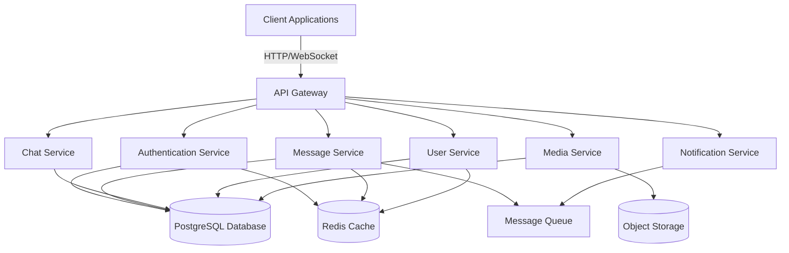

# Design Document

## Overview

The Telegram clone application will be built using a modern client-server architecture with real-time communication capabilities. The system consists of three main layers:

1. **Client Layer**: Web and mobile applications providing the user interface
2. **Server Layer**: Backend services handling business logic, authentication, and data management
3. **Data Layer**: Database and file storage systems

The architecture emphasizes:
- Real-time message delivery using WebSocket connections
- Scalable microservices design
- End-to-end encryption for secure communications
- Efficient media handling and storage
- High availability and fault tolerance

## Architecture

### High-Level Architecture



### Technology Stack

- **Backend**: Node.js with TypeScript, Express.js
- **Real-time Communication**: Socket.io for WebSocket connections
- **Database**: PostgreSQL for relational data
- **Cache**: Redis for session management and real-time data
- **Message Queue**: RabbitMQ for asynchronous processing
- **Object Storage**: AWS S3 or MinIO for media files
- **Encryption**: Node.js crypto module with AES-256 and RSA-2048
- **Testing**: Jest for unit tests, fast-check for property-based testing

## Components and Interfaces

### 1. Authentication Service

Handles user registration, login, and session management.

**Interfaces:**
```typescript
interface AuthService {
  sendVerificationCode(phoneNumber: string): Promise<VerificationSession>;
  verifyCode(sessionId: string, code: string): Promise<AuthToken>;
  refreshToken(refreshToken: string): Promise<AuthToken>;
  logout(userId: string): Promise<void>;
}

interface VerificationSession {
  sessionId: string;
  phoneNumber: string;
  expiresAt: Date;
  attemptsRemaining: number;
}

interface AuthToken {
  accessToken: string;
  refreshToken: string;
  userId: string;
  expiresIn: number;
}
```

### 2. User Service

Manages user profiles, contacts, and privacy settings.

**Interfaces:**
```typescript
interface UserService {
  createProfile(userId: string, profile: UserProfile): Promise<User>;
  updateProfile(userId: string, updates: Partial<UserProfile>): Promise<User>;
  getUser(userId: string): Promise<User>;
  addContact(userId: string, contactId: string): Promise<void>;
  removeContact(userId: string, contactId: string): Promise<void>;
  blockUser(userId: string, blockedUserId: string): Promise<void>;
  getContacts(userId: string): Promise<Contact[]>;
  updateOnlineStatus(userId: string, status: OnlineStatus): Promise<void>;
}

interface User {
  id: string;
  phoneNumber: string;
  username?: string;
  name: string;
  profilePicture?: string;
  bio?: string;
  createdAt: Date;
  lastSeen: Date;
  onlineStatus: OnlineStatus;
}

interface Contact {
  user: User;
  addedAt: Date;
}

enum OnlineStatus {
  ONLINE = 'online',
  OFFLINE = 'offline',
  AWAY = 'away'
}
```

### 3. Chat Service

Manages chat creation, participant management, and chat settings.

**Interfaces:**
```typescript
interface ChatService {
  createDirectChat(userId1: string, userId2: string): Promise<Chat>;
  createGroupChat(creatorId: string, participantIds: string[], settings: GroupChatSettings): Promise<Chat>;
  addParticipant(chatId: string, userId: string, addedBy: string): Promise<void>;
  removeParticipant(chatId: string, userId: string, removedBy: string): Promise<void>;
  updateChatSettings(chatId: string, settings: Partial<GroupChatSettings>): Promise<Chat>;
  assignAdmin(chatId: string, userId: string, assignedBy: string): Promise<void>;
  getChat(chatId: string): Promise<Chat>;
  getUserChats(userId: string): Promise<Chat[]>;
}

interface Chat {
  id: string;
  type: ChatType;
  participants: Participant[];
  settings?: GroupChatSettings;
  createdAt: Date;
  updatedAt: Date;
}

enum ChatType {
  DIRECT = 'direct',
  GROUP = 'group'
}

interface Participant {
  userId: string;
  role: ParticipantRole;
  joinedAt: Date;
}

enum ParticipantRole {
  MEMBER = 'member',
  ADMIN = 'admin',
  CREATOR = 'creator'
}

interface GroupChatSettings {
  name: string;
  description?: string;
  photo?: string;
}
```

### 4. Message Service

Handles message sending, delivery, and retrieval.

**Interfaces:**
```typescript
interface MessageService {
  sendMessage(message: MessageInput): Promise<Message>;
  editMessage(messageId: string, newContent: string, userId: string): Promise<Message>;
  deleteMessage(messageId: string, userId: string, deleteForAll: boolean): Promise<void>;
  getMessages(chatId: string, limit: number, before?: string): Promise<Message[]>;
  markAsDelivered(messageId: string, userId: string): Promise<void>;
  markAsRead(messageId: string, userId: string): Promise<void>;
  searchMessages(userId: string, query: string, chatId?: string): Promise<SearchResult[]>;
}

interface MessageInput {
  chatId: string;
  senderId: string;
  content: string;
  type: MessageType;
  mediaId?: string;
  replyToId?: string;
}

interface Message {
  id: string;
  chatId: string;
  senderId: string;
  content: string;
  type: MessageType;
  mediaId?: string;
  replyToId?: string;
  createdAt: Date;
  editedAt?: Date;
  isEdited: boolean;
  deliveryStatus: DeliveryStatus[];
  readStatus: ReadStatus[];
}

enum MessageType {
  TEXT = 'text',
  IMAGE = 'image',
  VIDEO = 'video',
  AUDIO = 'audio',
  DOCUMENT = 'document'
}

interface DeliveryStatus {
  userId: string;
  deliveredAt: Date;
}

interface ReadStatus {
  userId: string;
  readAt: Date;
}

interface SearchResult {
  message: Message;
  chat: Chat;
  highlightedContent: string;
}
```

### 5. Media Service

Handles media upload, storage, and retrieval.

**Interfaces:**
```typescript
interface MediaService {
  uploadMedia(file: File, userId: string): Promise<MediaFile>;
  getMedia(mediaId: string): Promise<MediaFile>;
  generateThumbnail(mediaId: string): Promise<string>;
  deleteMedia(mediaId: string): Promise<void>;
}

interface MediaFile {
  id: string;
  userId: string;
  filename: string;
  mimeType: string;
  size: number;
  url: string;
  thumbnailUrl?: string;
  uploadedAt: Date;
}

interface File {
  buffer: Buffer;
  originalname: string;
  mimetype: string;
  size: number;
}
```

### 6. Encryption Service

Provides encryption and decryption for messages.

**Interfaces:**
```typescript
interface EncryptionService {
  generateKeyPair(): Promise<KeyPair>;
  encryptMessage(content: string, publicKey: string): Promise<EncryptedData>;
  decryptMessage(encryptedData: EncryptedData, privateKey: string): Promise<string>;
  encryptForStorage(content: string): Promise<string>;
  decryptFromStorage(encryptedContent: string): Promise<string>;
}

interface KeyPair {
  publicKey: string;
  privateKey: string;
}

interface EncryptedData {
  ciphertext: string;
  iv: string;
  authTag: string;
}
```

### 7. Notification Service

Manages push notifications for users.

**Interfaces:**
```typescript
interface NotificationService {
  sendNotification(userId: string, notification: Notification): Promise<void>;
  registerDevice(userId: string, deviceToken: string): Promise<void>;
  unregisterDevice(userId: string, deviceToken: string): Promise<void>;
  muteChat(userId: string, chatId: string, duration: number): Promise<void>;
  unmuteChat(userId: string, chatId: string): Promise<void>;
}

interface Notification {
  title: string;
  body: string;
  chatId: string;
  messageId: string;
  type: NotificationType;
}

enum NotificationType {
  NEW_MESSAGE = 'new_message',
  MENTION = 'mention',
  GROUP_INVITE = 'group_invite'
}
```

### 8. Real-time Service

Manages WebSocket connections for real-time features.

**Interfaces:**
```typescript
interface RealtimeService {
  connect(userId: string, socket: Socket): void;
  disconnect(userId: string): void;
  broadcastMessage(chatId: string, message: Message): void;
  sendTypingIndicator(chatId: string, userId: string, isTyping: boolean): void;
  updateOnlineStatus(userId: string, status: OnlineStatus): void;
}
```

## Data Models

### Database Schema

```sql
-- Users table
CREATE TABLE users (
  id UUID PRIMARY KEY DEFAULT gen_random_uuid(),
  phone_number VARCHAR(20) UNIQUE NOT NULL,
  username VARCHAR(50) UNIQUE,
  name VARCHAR(100) NOT NULL,
  profile_picture TEXT,
  bio TEXT,
  created_at TIMESTAMP DEFAULT CURRENT_TIMESTAMP,
  last_seen TIMESTAMP DEFAULT CURRENT_TIMESTAMP,
  online_status VARCHAR(20) DEFAULT 'offline',
  public_key TEXT,
  encrypted_private_key TEXT
);

-- Contacts table
CREATE TABLE contacts (
  user_id UUID REFERENCES users(id) ON DELETE CASCADE,
  contact_id UUID REFERENCES users(id) ON DELETE CASCADE,
  added_at TIMESTAMP DEFAULT CURRENT_TIMESTAMP,
  PRIMARY KEY (user_id, contact_id)
);

-- Blocked users table
CREATE TABLE blocked_users (
  user_id UUID REFERENCES users(id) ON DELETE CASCADE,
  blocked_user_id UUID REFERENCES users(id) ON DELETE CASCADE,
  blocked_at TIMESTAMP DEFAULT CURRENT_TIMESTAMP,
  PRIMARY KEY (user_id, blocked_user_id)
);

-- Chats table
CREATE TABLE chats (
  id UUID PRIMARY KEY DEFAULT gen_random_uuid(),
  type VARCHAR(20) NOT NULL,
  name VARCHAR(100),
  description TEXT,
  photo TEXT,
  created_at TIMESTAMP DEFAULT CURRENT_TIMESTAMP,
  updated_at TIMESTAMP DEFAULT CURRENT_TIMESTAMP
);

-- Chat participants table
CREATE TABLE chat_participants (
  chat_id UUID REFERENCES chats(id) ON DELETE CASCADE,
  user_id UUID REFERENCES users(id) ON DELETE CASCADE,
  role VARCHAR(20) DEFAULT 'member',
  joined_at TIMESTAMP DEFAULT CURRENT_TIMESTAMP,
  PRIMARY KEY (chat_id, user_id)
);

-- Messages table
CREATE TABLE messages (
  id UUID PRIMARY KEY DEFAULT gen_random_uuid(),
  chat_id UUID REFERENCES chats(id) ON DELETE CASCADE,
  sender_id UUID REFERENCES users(id) ON DELETE SET NULL,
  content TEXT NOT NULL,
  encrypted_content TEXT,
  type VARCHAR(20) DEFAULT 'text',
  media_id UUID,
  reply_to_id UUID REFERENCES messages(id),
  created_at TIMESTAMP DEFAULT CURRENT_TIMESTAMP,
  edited_at TIMESTAMP,
  is_edited BOOLEAN DEFAULT FALSE
);

-- Message delivery status table
CREATE TABLE message_delivery (
  message_id UUID REFERENCES messages(id) ON DELETE CASCADE,
  user_id UUID REFERENCES users(id) ON DELETE CASCADE,
  delivered_at TIMESTAMP DEFAULT CURRENT_TIMESTAMP,
  PRIMARY KEY (message_id, user_id)
);

-- Message read status table
CREATE TABLE message_read (
  message_id UUID REFERENCES messages(id) ON DELETE CASCADE,
  user_id UUID REFERENCES users(id) ON DELETE CASCADE,
  read_at TIMESTAMP DEFAULT CURRENT_TIMESTAMP,
  PRIMARY KEY (message_id, user_id)
);

-- Media files table
CREATE TABLE media_files (
  id UUID PRIMARY KEY DEFAULT gen_random_uuid(),
  user_id UUID REFERENCES users(id) ON DELETE SET NULL,
  filename VARCHAR(255) NOT NULL,
  mime_type VARCHAR(100) NOT NULL,
  size BIGINT NOT NULL,
  url TEXT NOT NULL,
  thumbnail_url TEXT,
  uploaded_at TIMESTAMP DEFAULT CURRENT_TIMESTAMP
);

-- Verification sessions table
CREATE TABLE verification_sessions (
  id UUID PRIMARY KEY DEFAULT gen_random_uuid(),
  phone_number VARCHAR(20) NOT NULL,
  code VARCHAR(6) NOT NULL,
  attempts_remaining INTEGER DEFAULT 3,
  created_at TIMESTAMP DEFAULT CURRENT_TIMESTAMP,
  expires_at TIMESTAMP NOT NULL
);

-- Device tokens for notifications
CREATE TABLE device_tokens (
  user_id UUID REFERENCES users(id) ON DELETE CASCADE,
  token TEXT NOT NULL,
  platform VARCHAR(20) NOT NULL,
  registered_at TIMESTAMP DEFAULT CURRENT_TIMESTAMP,
  PRIMARY KEY (user_id, token)
);

-- Muted chats table
CREATE TABLE muted_chats (
  user_id UUID REFERENCES users(id) ON DELETE CASCADE,
  chat_id UUID REFERENCES chats(id) ON DELETE CASCADE,
  muted_until TIMESTAMP NOT NULL,
  PRIMARY KEY (user_id, chat_id)
);

-- Indexes for performance
CREATE INDEX idx_messages_chat_id ON messages(chat_id, created_at DESC);
CREATE INDEX idx_messages_sender_id ON messages(sender_id);
CREATE INDEX idx_chat_participants_user_id ON chat_participants(user_id);
CREATE INDEX idx_contacts_user_id ON contacts(user_id);
CREATE INDEX idx_users_username ON users(username);
CREATE INDEX idx_users_phone_number ON users(phone_number);
```


## Correctness Properties

*A property is a characteristic or behavior that should hold true across all valid executions of a system—essentially, a formal statement about what the system should do. Properties serve as the bridge between human-readable specifications and machine-verifiable correctness guarantees.*

### Authentication Properties

Property 1: Verification session creation
*For any* valid phone number, sending a verification code should create a verification session with the phone number, expiration time, and attempt counter
**Validates: Requirements 1.1**

Property 2: Valid code authentication
*For any* verification session with a valid code entered within the expiration time, authentication should succeed and create a user account
**Validates: Requirements 1.2**

Property 3: Invalid code rejection
*For any* verification session with an invalid code, the system should reject authentication and decrement the attempts counter, allowing up to 3 attempts
**Validates: Requirements 1.3**

Property 4: Session persistence
*For any* authenticated user, their session token should remain valid for 30 days without requiring re-authentication
**Validates: Requirements 1.4**

Property 5: Profile data round-trip
*For any* valid profile information (name, username, profile picture), storing then retrieving should return equivalent data
**Validates: Requirements 1.5**

### Messaging Properties

Property 6: Message delivery to all participants
*For any* message sent to a chat, all chat participants should receive the message
**Validates: Requirements 2.1**

Property 7: Delivery status tracking
*For any* message delivered to a recipient, a delivery status record should be created for that recipient
**Validates: Requirements 2.2**

Property 8: Read status tracking
*For any* message read by a recipient, a read status record should be created for that recipient
**Validates: Requirements 2.3**

Property 9: Offline message queuing
*For any* offline user, messages sent to their chats should be queued and delivered when the user comes online
**Validates: Requirements 2.4**

Property 10: Typing indicator broadcast
*For any* user typing in a chat, other chat participants should receive a typing indicator event
**Validates: Requirements 2.5, 6.5**

### Group Chat Properties

Property 11: Group creation with participants
*For any* set of selected contacts, creating a group chat should result in a chat with all selected users as participants
**Validates: Requirements 3.1**

Property 12: Participant addition
*For any* user added to a group chat, that user should appear in the chat's participant list
**Validates: Requirements 3.2**

Property 13: Participant removal
*For any* user removed from a group chat, that user should no longer appear in the chat's participant list
**Validates: Requirements 3.3**

Property 14: Admin role assignment
*For any* participant promoted to admin, their role in the chat should be updated to admin
**Validates: Requirements 3.4**

Property 15: Group settings persistence
*For any* group chat settings modification (name, photo, description), the updated settings should be persisted and retrievable
**Validates: Requirements 3.5**

### Media Properties

Property 16: Media upload creates message
*For any* media file uploaded by a user, the system should create a media record and a corresponding message in the chat
**Validates: Requirements 4.1**

Property 17: Thumbnail generation
*For any* image or video message, a thumbnail should be generated and associated with the media
**Validates: Requirements 4.2**

Property 18: Media retrieval
*For any* media message, the media content should be retrievable via the media URL
**Validates: Requirements 4.3**

Property 19: Upload progress events
*For any* media upload, progress events should be emitted during the upload process
**Validates: Requirements 4.5**

### Search Properties

Property 20: Search result matching
*For any* search query and message set, all returned results should contain the query text
**Validates: Requirements 5.1**

Property 21: Search result highlighting
*For any* search result, the highlighted content should contain the query text
**Validates: Requirements 5.2**

Property 22: Chat-scoped search
*For any* search within a specific chat, all returned messages should belong to that chat
**Validates: Requirements 5.3**

### Online Status Properties

Property 23: Active user online status
*For any* user actively using the system, their online status should be set to online
**Validates: Requirements 6.1**

Property 24: Last seen update on disconnect
*For any* user disconnecting or becoming inactive, their last seen timestamp should be updated to the disconnect time
**Validates: Requirements 6.2**

Property 25: Status retrieval
*For any* contact, their current online status should be retrievable
**Validates: Requirements 6.3**

Property 26: Privacy-respecting status display
*For any* user with privacy settings enabled, their online status should only be visible to users allowed by those settings
**Validates: Requirements 6.4**

### Contact Management Properties

Property 27: Contact addition
*For any* valid phone number or username, adding as a contact should result in that user appearing in the contact list
**Validates: Requirements 7.1**

Property 28: Contact removal preserves history
*For any* contact removal, the contact should be removed from the list but chat history with that contact should remain intact
**Validates: Requirements 7.2**

Property 29: Blocking prevents messages
*For any* blocked user, messages sent by that user should not be delivered to the blocking user
**Validates: Requirements 7.3**

Property 30: Contact list sorting
*For any* contact list retrieval, contacts should be sorted alphabetically by name
**Validates: Requirements 7.4**

Property 31: Profile update synchronization
*For any* user profile update, the changes should be reflected in all contact lists containing that user
**Validates: Requirements 7.5**

### Encryption Properties

Property 32: Message encryption before transmission
*For any* message sent, the content should be encrypted before being transmitted over the network
**Validates: Requirements 8.1**

Property 33: Encryption round-trip
*For any* message content, encrypting then decrypting should return the original content
**Validates: Requirements 8.2**

Property 34: Storage encryption
*For any* message stored in the database, the content should be in encrypted form
**Validates: Requirements 8.3**

Property 35: Direct chat E2E encryption
*For any* direct chat, all messages should use end-to-end encryption
**Validates: Requirements 8.4**

Property 36: Cryptographic algorithm compliance
*For any* encryption key generation, the algorithm used should be AES-256 for symmetric encryption or RSA-2048 for asymmetric encryption
**Validates: Requirements 8.5**

### Notification Properties

Property 37: Background message notifications
*For any* message received while the user's application is in background, a notification should be created
**Validates: Requirements 9.1**

Property 38: Notification grouping by chat
*For any* set of multiple messages from the same chat, notifications should be grouped together by chat
**Validates: Requirements 9.2**

Property 39: Muted chat notification suppression
*For any* muted chat, notifications for messages in that chat should be suppressed until the mute expires
**Validates: Requirements 9.3**

Property 40: Notification preference respect
*For any* user with notifications disabled in settings, no notifications should be sent to that user
**Validates: Requirements 9.5**

### Message Editing and Deletion Properties

Property 41: Message editing within time limit
*For any* message edited within 48 hours of creation, the content should be updated and the isEdited flag should be set to true
**Validates: Requirements 10.1, 10.3**

Property 42: Message deletion for all
*For any* message deleted for all participants, the message should not be visible to any participant
**Validates: Requirements 10.2**

Property 43: Self-deletion visibility
*For any* message deleted by a user for themselves only, the message should be hidden from that user's view but remain visible to other participants
**Validates: Requirements 10.4**

Property 44: Time-limited editing enforcement
*For any* message older than 48 hours, edit attempts should be rejected
**Validates: Requirements 10.5**

## Error Handling

### Error Types

The system will handle the following error categories:

1. **Authentication Errors**
   - Invalid phone number format
   - Verification code expired
   - Maximum retry attempts exceeded
   - Invalid or expired session token

2. **Authorization Errors**
   - User not a member of the chat
   - Insufficient permissions for admin actions
   - Blocked user attempting to send messages

3. **Validation Errors**
   - Empty message content
   - Invalid file type or size
   - Invalid username format
   - Missing required fields

4. **Resource Errors**
   - Chat not found
   - User not found
   - Message not found
   - Media file not found

5. **Rate Limiting Errors**
   - Too many verification code requests
   - Too many messages sent in short time
   - Too many API requests

6. **External Service Errors**
   - SMS service unavailable
   - Object storage unavailable
   - Database connection failure

### Error Response Format

All errors will follow a consistent format:

```typescript
interface ErrorResponse {
  error: {
    code: string;
    message: string;
    details?: any;
    timestamp: Date;
  };
}
```

### Error Handling Strategy

- All service methods should throw typed errors that can be caught and handled appropriately
- API endpoints should catch errors and return appropriate HTTP status codes
- WebSocket errors should be sent to clients with error event types
- Critical errors should be logged with full context for debugging
- User-facing error messages should be clear and actionable
- Retry logic should be implemented for transient failures (database, external services)

## Testing Strategy

### Unit Testing

Unit tests will be written using Jest and will cover:

- Individual service methods with specific inputs and expected outputs
- Edge cases such as empty inputs, boundary values, and invalid data
- Error conditions and exception handling
- Data validation logic
- Utility functions and helpers

Example unit test structure:
```typescript
describe('MessageService', () => {
  describe('sendMessage', () => {
    it('should create a message with valid input', async () => {
      // Test specific example
    });
    
    it('should reject empty message content', async () => {
      // Test edge case
    });
  });
});
```

### Property-Based Testing

Property-based tests will be written using fast-check library to verify universal properties across many randomly generated inputs. Each property-based test will:

- Run a minimum of 100 iterations with randomly generated data
- Be tagged with a comment referencing the specific correctness property from this design document
- Use the format: `// Feature: telegram-clone, Property X: [property description]`
- Test general correctness rather than specific examples

Example property test structure:
```typescript
import * as fc from 'fast-check';

describe('MessageService Properties', () => {
  it('Property 6: Message delivery to all participants', async () => {
    // Feature: telegram-clone, Property 6: Message delivery to all participants
    await fc.assert(
      fc.asyncProperty(
        fc.record({
          chatId: fc.uuid(),
          senderId: fc.uuid(),
          content: fc.string({ minLength: 1 }),
          participantIds: fc.array(fc.uuid(), { minLength: 2, maxLength: 10 })
        }),
        async (input) => {
          // Test that message is delivered to all participants
        }
      ),
      { numRuns: 100 }
    );
  });
});
```

### Integration Testing

Integration tests will verify:
- End-to-end message flow from sending to receiving
- WebSocket connection and real-time updates
- Database transactions and data consistency
- Authentication flow from verification to session creation
- Media upload and retrieval pipeline

### Test Data Generators

For property-based testing, we will create smart generators that:
- Generate valid user data (phone numbers, usernames, names)
- Generate valid message content including edge cases (empty, very long, special characters)
- Generate valid chat structures with varying numbers of participants
- Generate media files of different types and sizes
- Generate timestamps and time-based scenarios
- Include edge cases like large files (>100MB) and special characters in search queries

### Testing Priorities

1. Core messaging functionality (send, receive, deliver, read)
2. Authentication and authorization
3. Encryption and decryption
4. Group chat management
5. Media handling
6. Search functionality
7. Real-time features (typing indicators, online status)
8. Notification system

## Security Considerations

### Authentication Security

- Phone number verification with time-limited codes
- Secure session token generation using cryptographically secure random values
- Token refresh mechanism to limit exposure of long-lived tokens
- Rate limiting on verification code requests to prevent abuse

### Message Security

- End-to-end encryption for direct chats using RSA-2048 key pairs
- Server-side encryption for group chats using AES-256
- Encrypted storage of messages in database
- Secure key exchange and management

### API Security

- JWT-based authentication for all API requests
- HTTPS/TLS for all network communication
- WebSocket connection authentication
- Input validation and sanitization
- SQL injection prevention using parameterized queries
- XSS prevention in message content

### Privacy Controls

- User-configurable online status visibility
- User-configurable last seen visibility
- Blocking functionality to prevent unwanted contact
- Message deletion capabilities

## Performance Considerations

### Real-time Performance

- WebSocket connections for instant message delivery
- Redis pub/sub for scaling real-time features across multiple servers
- Connection pooling for database queries
- Efficient message queuing for offline users

### Database Performance

- Indexed queries for common operations (message retrieval, user lookup)
- Pagination for large result sets
- Denormalization where appropriate for read-heavy operations
- Database connection pooling

### Media Performance

- Thumbnail generation for quick preview loading
- Chunked upload for large files
- CDN integration for media delivery
- Lazy loading of media content
- Compression for images and videos

### Scalability

- Horizontal scaling of API servers
- Message queue for asynchronous processing
- Caching layer (Redis) for frequently accessed data
- Database read replicas for read-heavy operations
- Load balancing across multiple servers

## Deployment Architecture

### Infrastructure Components

- **Load Balancer**: Distributes traffic across API servers
- **API Servers**: Multiple instances for high availability
- **WebSocket Servers**: Dedicated servers for real-time connections
- **Database**: PostgreSQL with replication
- **Cache**: Redis cluster
- **Message Queue**: RabbitMQ cluster
- **Object Storage**: S3-compatible storage for media files
- **Monitoring**: Application and infrastructure monitoring

### Environment Configuration

- Development: Single server setup for local development
- Staging: Scaled-down production-like environment
- Production: Fully scaled with redundancy and failover

## Future Enhancements

Potential features for future iterations:

- Voice and video calling
- Message reactions and emoji responses
- Message forwarding
- Channels for broadcast messaging
- Bots and automation
- Stickers and GIF support
- Message scheduling
- Self-destructing messages
- Multi-device synchronization
- Desktop and mobile applications
